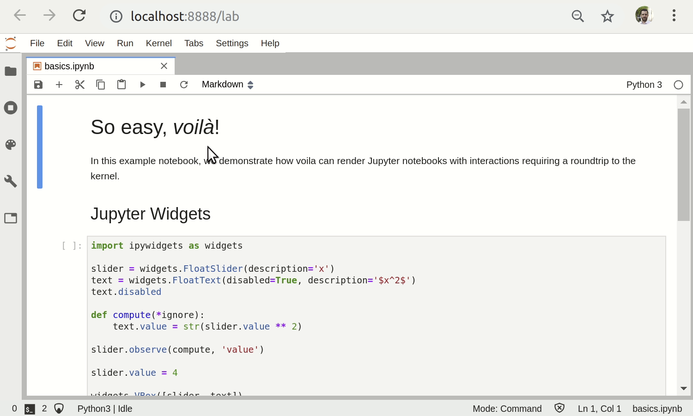
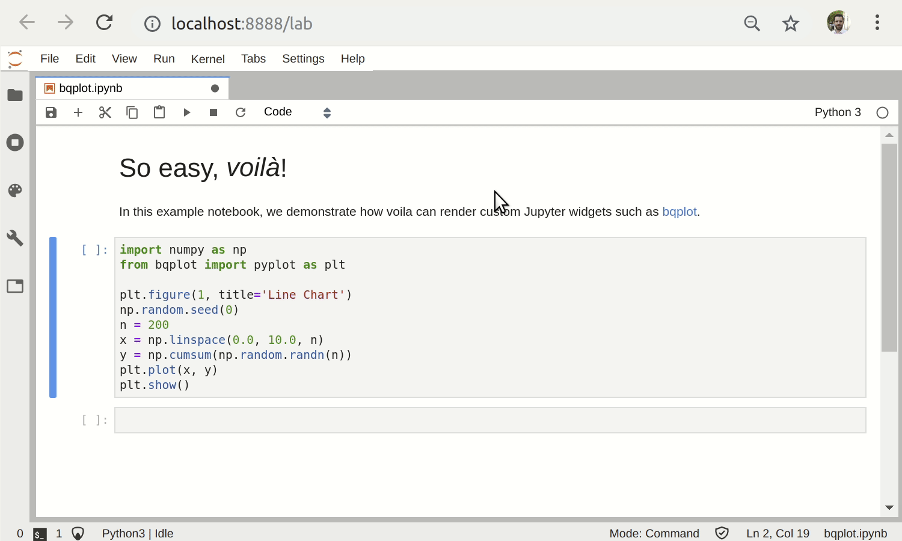
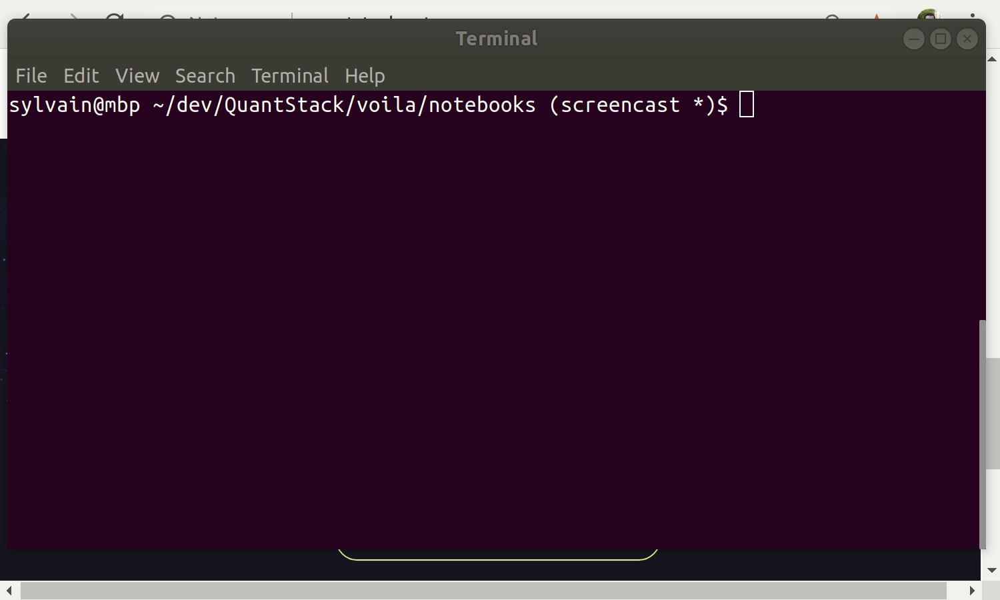
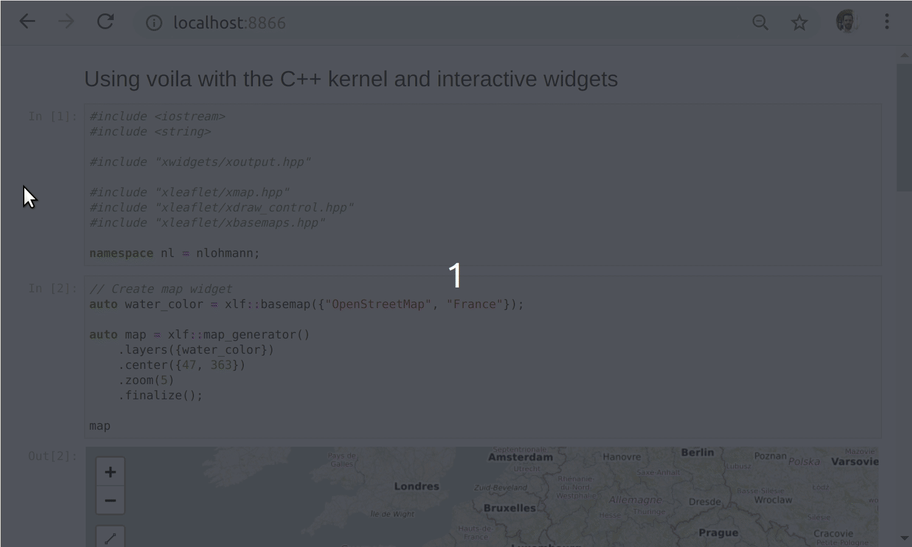

# 

[](https://voila.readthedocs.io/en/latest/?badge=latest)
[](https://mybinder.org/v2/gh/voila-dashboards/voila/stable?urlpath=voila%2Ftree%2Fnotebooks)
[](https://gitter.im/QuantStack/Lobby?utm_source=badge&utm_medium=badge&utm_campaign=pr-badge&utm_content=badge)

Rendering of live Jupyter notebooks with interactive widgets.

## Introduction

Voilà turns Jupyter notebooks into standalone web applications.

Unlike the usual HTML-converted notebooks, each user connecting to the Voilà
tornado application gets a dedicated Jupyter kernel which can execute the
callbacks to changes in Jupyter interactive widgets.

- By default, Voilà disallows execute requests from the front-end, preventing
  execution of arbitrary code.
- By default, Voilà runs with the `strip_sources` option, which strips out the
  input cells from the rendered notebook.

## Installation

Voilà can be installed with the mamba (or conda) package manager from conda-forge

```
mamba install -c conda-forge voila
```

or from PyPI

```
pip install voila
```

### JupyterLab preview extension

Voilà provides a JupyterLab extension that displays a Voilà preview of your Notebook in a side-pane.

Starting with JupyterLab 3.0, the extension is **automatically installed** after installing `voila`
with `pip install voila`.

If you would like to install the extension from source, run the following command.

```
jupyter labextension install @voila-dashboards/jupyterlab-preview
```

## Usage

### As a standalone tornado application

To render the `bqplot` example notebook as a standalone app, run
`voila bqplot.ipynb`.
To serve a directory of jupyter notebooks, run `voila` with no argument.

For example, to render the example notebook `bqplot.ipynb` from this repository with Voilà, you can first update your current environment with the requirements of this notebook (in this case in a [conda environment](https://docs.conda.io/projects/conda/en/latest/user-guide/tasks/manage-environments.html) and render the notebook with

```
mamba env update -f .binder/environment.yml
cd notebooks/
voila bqplot.ipynb
```

For more command line options (e.g., to specify an alternate port number),
run `voila --help`.

### As a server extension to `notebook` or `jupyter_server`

Voilà can also be used as a Jupyter server extension, both with the
[notebook](https://github.com/jupyter/notebook) server or with
[jupyter_server](https://github.com/jupyter/jupyter_server).

To install the Jupyter server extension, run

```
jupyter serverextension enable voila
jupyter server extension enable voila
```

When running the Jupyter server, the Voilà app is accessible from the base url
suffixed with `voila`.

## Documentation

To get started with using Voilà, check out the full documentation:

https://voila.readthedocs.io/

## Examples

The following two examples show how a standalone Jupyter notebook can be turned into a separate app, from the command-line integration.

### Rendering a notebook including interactive widgets and rich mime-type rendering



### Rendering a notebook making use of a custom widget library ([bqplot](https://github.com/bloomberg/bqplot))



### Showing the source code for a Voilà notebook

The sources of the Jupyter notebook can be displayed in a Voilà app if option `strip_sources` is set to `False`.



### Voilà dashboards with other language kernels\*\*

Voilà is built upon Jupyter standard formats and protocols, and is agnostic to the programming language of the notebook. In this example, we present an example of a Voilà application powered by the C++ Jupyter kernel [xeus-cling](https://github.com/jupyter-xeus/xeus-cling), and the [xleaflet](https://github.com/jupyter-xeus/xleaflet) project.



## The Voilà Gallery

The [Voilà Gallery](https://voila-gallery.org) is a collection of live dashboards and applications built with Voilà and Jupyter widgets.

Most of the examples rely on widget libraries such as ipywidgets, ipyleaflet, ipyvolume, bqplot and ipympl, and showcase how to build complex web applications entirely based on notebooks.

New examples can be added to the gallery by following the steps listed in the [voila-gallery/gallery](https://github.com/voila-gallery/gallery) repository.

## Development

See [CONTRIBUTING.md](./CONTRIBUTING.md) to know how to contribute and set up a development environment.

## Related projects

Voilà depends on [nbconvert](https://github.com/jupyter/nbconvert) and
[jupyter_server](https://github.com/jupyter/jupyter_server/).

## License

We use a shared copyright model that enables all contributors to maintain the
copyright on their contributions.

This software is licensed under the BSD-3-Clause license. See the
[LICENSE](LICENSE) file for details.
