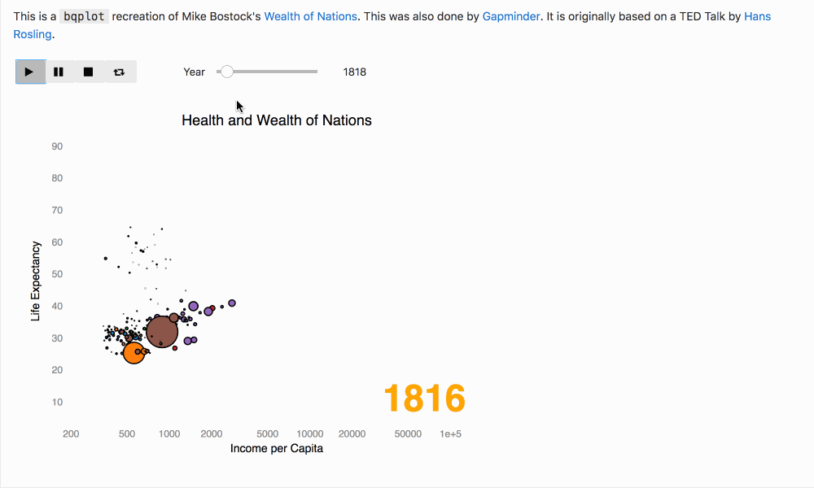

=====
Voila
=====

Create interactive dashboards with Jupyter Notebooks.

Voila allows you to convert a Jupyter Notebook into an
interactive dashboard that allows you to share your work with others. It
is secure and customizable, giving you control over what your readers
experience.

For example, here's a dashboard created with Voila. (you can
try it interactively at the following Binder link)

.. image:: https://mybinder.org/badge_logo.svg
   :target: https://mybinder.org/v2/gh/QuantStack/voila/master?urlpath=voila%2Ftree%2Fnotebooks

.. raw:: html

    

Table of contents
=================

For more information  about Voila, see the sections below.

.. toctree::
   :maxdepth: 2

   install
   using
   customize
